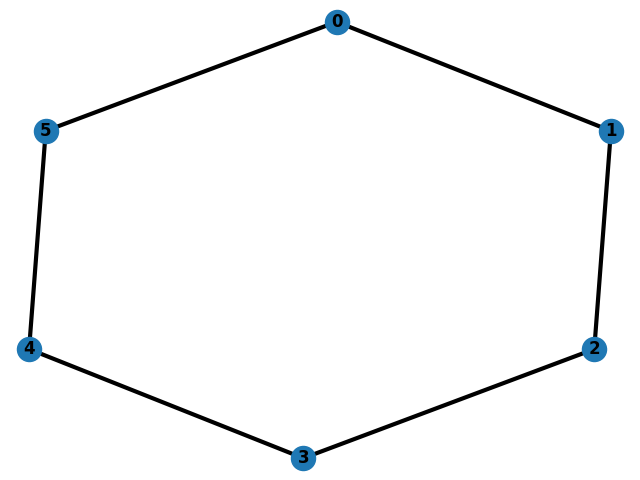
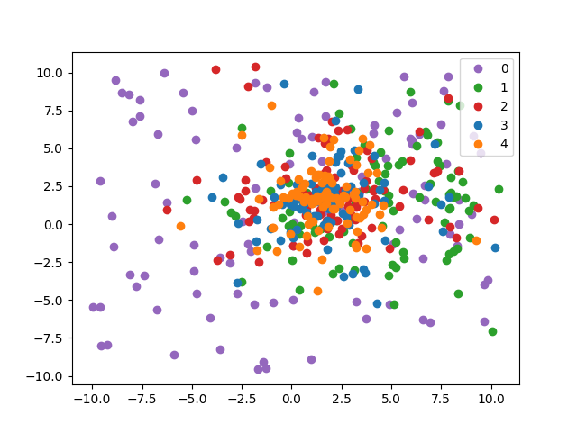

<h1 style="text-align:center">Particle Swarm Optimization </h1>

Bárbara Boechat 
Algoritmos Bioinspirados

### Instruções

Para rodar este trabalho será preciso executar o arquivo `runme.sh`, entao talvez seja necessário dar a ele permissões, para isso utilize o comando `chmod +x runme.sh`.Este script deve primeiro gerar todas as entradas ao rodar `entradas.py`, em seguida cada uma das entradas será executada 5 vezes e seus resultados estarão num arquivo results2.csv.

### Function for Global Optimization

A função de minimização escolhida foi Alpine 1 Function, como mostra a figura a seguir.

  

### Topologia Utilizada

A topologia utilizada foi a mostrada na figura a seguir. Nesta topologia cada nó possui apenas 2 vizinhos.

  

### Progresso das Partículas durante as iterações

Nos exemplos a seguir foi plotado o comportamento de partículas de 2 dimensões, para ter uma visão de como estavam se comportando 100 partículas num loop de 5 iterações. Ao inicío, setadas aleatoriamente elas encontram-se mais espalhadas, e após cada iterações tendem a convergir para um local comum, criando uma aglomeração de partículas na cor laranja. 

  

### Nuvem de Partículas antes e depois
Neste gráfico, também com partículas de 2 dimensões, é mostrado apenas o estado inicial, com as partículas completamente espalhadas. E o estado final, em que elas convergiram para um local comum, encontrando como ótimo global a única párticula plotada em vermelho, é possível perceber que suas coordenadas x e y estão bem próximas de 0, que é o minimo global da função escolhida.

  

### Tabela de Resultados

Os resultados não foram muito bons principalmente para um número maior de dimensões, inclusive quão maior o número de dimensões maior era a fo. Talvez para maiores dimensões seja indicado uma núvem de partículas e número de iterações maior do que os utilizados neste teste, ou até uma topologia diferente. 

| Dimensão | Tamanho da Nuvem | Nº de Iterações | Diversification Factor | Social/Cognitive Factor | Fo      |
|----------|------------------|-----------------|------------------------|-------------------------|---------|
| 10       | 100              | 100             | 0.5                    | 1.5                     | 3.6014  |
| 20       | 100              | 100             | 0.9                    | 1.5                     | 11.5548 |
| 30       | 100              | 100             | 0.1                    | 1.5                     | 27.3502 |
| 40       | 100              | 50              | 0.5                    | 1.25                    | 48.8268 |
| 50       | 50               | 50              | 0.1                    | 1.25                    | 59.1652 |

